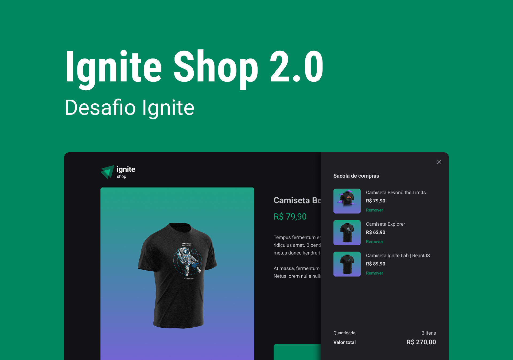
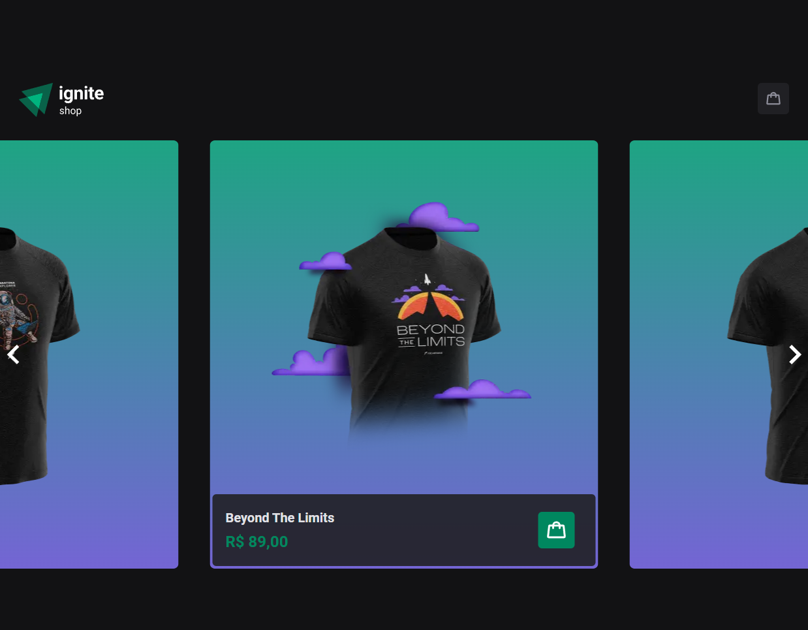
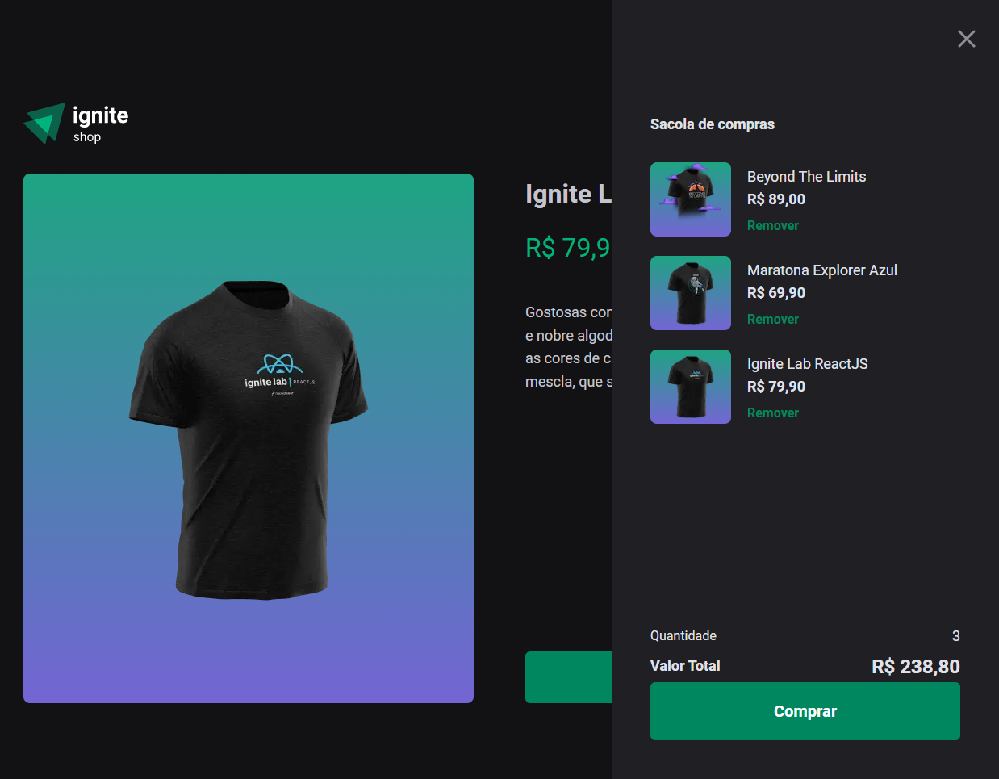
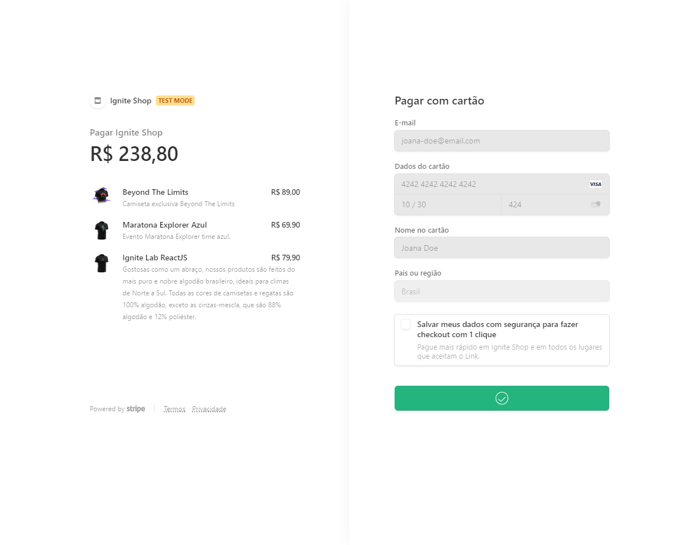
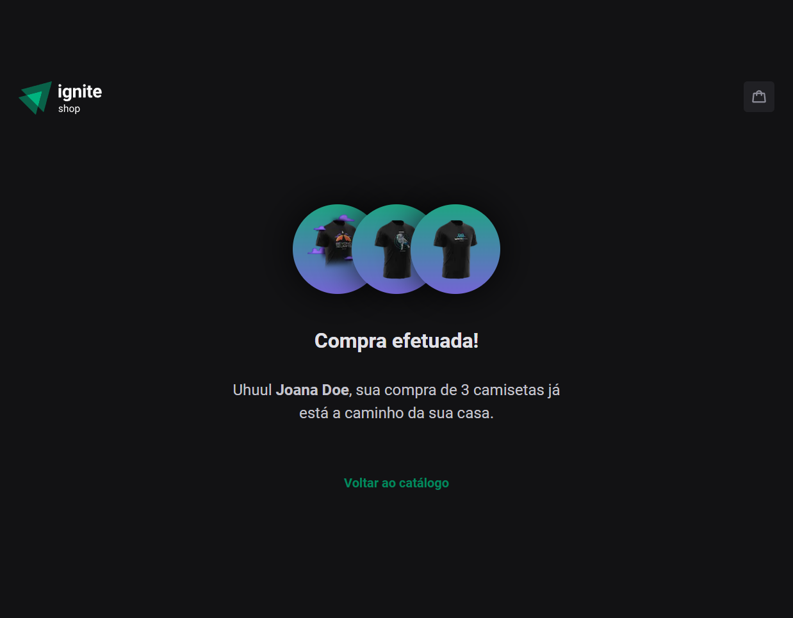

<h1 align="center">
   Ignite Shop
</h1>

<p align="center">
  
  
  
  
  
</p>

---

<p align="center">
  <a href="#-projeto">Projeto</a>&nbsp;&nbsp;&nbsp;|&nbsp;&nbsp;&nbsp;
  <a href="#-como-rodar-o-projeto">Como rodar o projeto</a>&nbsp;&nbsp;&nbsp;|&nbsp;&nbsp;&nbsp;
  <a href="#-tecnologias">Tecnologias</a>&nbsp;&nbsp;&nbsp;|&nbsp;&nbsp;&nbsp;
  <a href="#-layout">Layout</a>&nbsp;&nbsp;&nbsp;|&nbsp;&nbsp;&nbsp;
  <a href="#-licença">Licença</a>
</p>

## 💻 Projeto

O **Ignite Shop** é um site de venda de camisas que oferece uma seleção única de produtos de alta qualidade. Com uma interface moderna e elegante, o site permite que os usuários naveguem pelos produtos disponíveis no formato de carrossel, tornando mais fácil encontrar a camisa perfeita para cada ocasião.

Os usuários podem adicionar e remover itens do carrinho de compras com facilidade, garantindo que apenas os itens desejados sejam comprados. E quando estiver pronto para finalizar a compra, o usuário pode pagar com cartão de crédito de forma segura e conveniente, com a garantia de que seus dados são protegidos.

Com o **Ignite Shop**, os usuários podem encontrar camisas de alta qualidade a preços acessíveis. Com uma ampla variedade de estilos, cores e tamanhos, o site é perfeito para quem busca praticidade e qualidade em uma experiência de compra online.

O **Ignite Shop** é acessível pelo link [https://emidio-ignite-shop.vercel.app/](https://emidio-ignite-shop.vercel.app/) e é a escolha ideal para quem procura camisas de alta qualidade com preços acessíveis. Não perca a oportunidade de comprar agora e atualizar o seu guarda-roupa com o **Ignite Shop**!

### 🌐 Telas do site

**Página inicial**



**Adicionando item ao carrinho**



**Relizando pagamento**



**Pagamento realizado com sucesso**



## 🧭 Como rodar o projeto

### 🚨 Requisitos

**Possuir uma conta no Stripe**

- [Stripe](https://stripe.com/br)

**Clone este repositório**

```bash
git clone https://github.com/vitorsemidio-dev/ignite-shop.git
```

**Acesse a pasta**

```bash
cd ignite-shop
```

### 🔑 Variáveis Ambiente

Crie um arquivo com o nome `env.local` e preencha as informações.

É possível consultar os valores das chaves em [Stripe Api Keys](https://dashboard.stripe.com/test/apikeys)

```env
# App
NEXT_URL=http://localhost:3000

# Stripe

STRIPE_PUBLIC_KEY=
STRIPE_SECRET_KEY=

```

**Instale as dependências e inicie o projeto**

```bash
npm install
```

```bash
npm run dev
```

## 🚀 Tecnologias

Esse projeto foi desenvolvido com as seguintes tecnologias:

- [Axios](https://axios-http.com/)
- [Keen slider](https://keen-slider.io/)
- [Next.js](https://nextjs.org/)
- [Phosphor React](https://phosphoricons.com/react/)
- [React](https://reactjs.org/)
- [Stripe](https://stripe.com/)
- [use-shopping-cart](https://useshoppingcart.com/)

## 🔖 Layout

Você pode visualizar o layout do projeto através [deste link](https://www.figma.com/file/OIJJEW24DFiJO6XLqHw2DM/Ignite-Shop).

<a href="https://www.figma.com/file/OIJJEW24DFiJO6XLqHw2DM/Ignite-Shop">
  
</a>

## 📝 Licença

Esse projeto está sob a licença MIT. Veja o arquivo [LICENSE](LICENSE) para mais detalhes.
